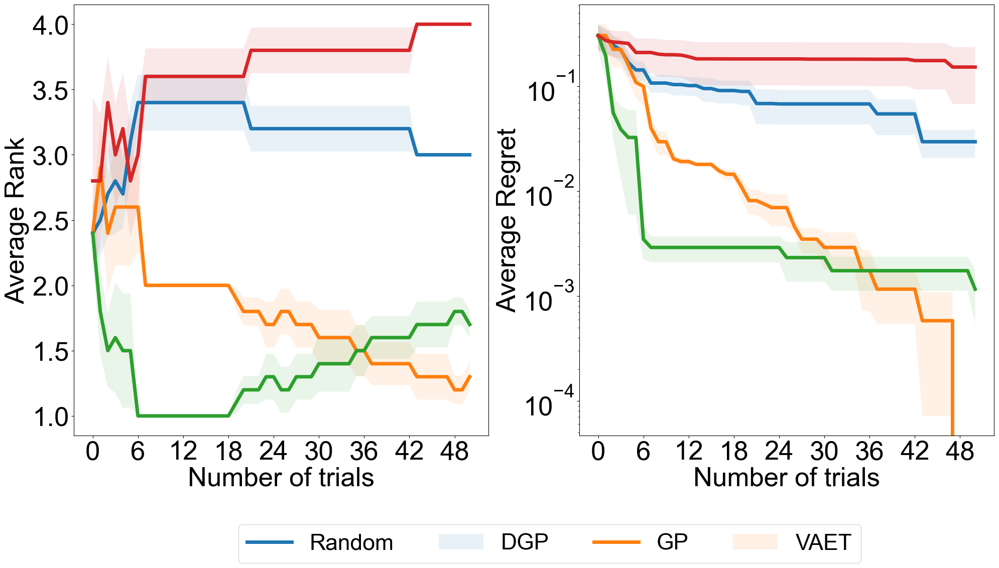

# VAE-Transformer based HPO Model 
This repo is derived from [HPO-B repo](https://github.com/releaunifreiburg/HPO-B) to evaluate the newly proposed generative based black-box HPO algorithm on their benchmark meta-dataset to assess the performance of the proposed VAE-Transformer model.

## Downloads
1. **HPO-B Dataset**:
The [HPO-B Paper](https://arxiv.org/pdf/2106.06257.pdf) discusses various search spaces across different datasets. You can download the dataset from [here](https://rewind.tf.uni-freiburg.de/index.php/s/xdrJQPCTNi2zbfL/download/hpob-data.zip).

2. **Surrogates for Continuous Search Spaces**: The model is evaluated on continuous search spaces. Download the necessary surrogate models from [here](https://rewind.tf.uni-freiburg.de/index.php/s/rTwPgaxS2Z7NH39/download/saved-surrogates.zip).

## Steps to run the project
1. **Prepare the Folders**:
   - Extract the dowloaded files and place the folders in the root directory of the project.

2. **Run VAET Example**:
   - Execute the VAET example script with the following command:
     ```
     python example_vaet.py
     ```
   - This will create a `results/VAET.json` file containing accuracy results for different seeds on all datasets of search-space id `5971`.

3. **Run VAET Benchmark**:
   - To generate benchmark comparisons, use this command:
     ```
     python examplevaet_benchmark.py
     ```
   - This script generates plots of rank regret, comparing the performance of the proposed generative-based black-box algorithm against methods like Random Search, Gaussian Process, and Deep Gaussian Process.

## Results


## References
- [HPO-B Benchmark GitHub](https://github.com/releaunifreiburg/HPO-B)
- Pineda-Arango, S., Jomaa, H. S., Wistuba, M., & Grabocka, J. (2021). HPO-B: [A Large-Scale Reproducible Benchmark for Black-Box HPO Based on OpenML. In Neural Information Processing Systems (NeurIPS) Track on Datasets and Benchmarks.](https://arxiv.org/pdf/2106.06257.pdf)


